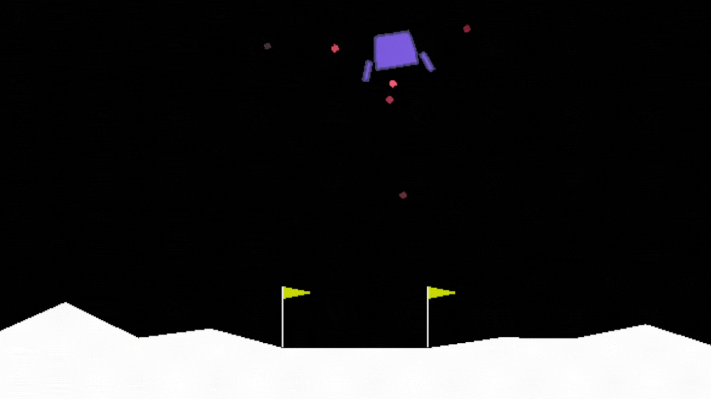

# Reinforcement Learning: Lunar Lander
## Project Overview
This project is a basic exercise in demonstrating the use of artificial intelligence with neural networks and reinforcement learning to have a Player (the AI) learn how to play a simple 2D game, Lunar Lander, with the goal of landing a space-ship between two flags on a random terrain. The space-ship is capable of making very basic movements (do nothing, fire left engine, fire down engine, and fire right engine) in order to navigate to the goal. 

The main technologies & libraries used in this project include:
- Python
- Visual Studio Code IDE
- [OpenAI's Gym API](https://github.com/openai/gym) - for the Lunar Lander game environment
- [Stable-Baselines3 Reinforcement Learning API](https://github.com/DLR-RM/stable-baselines3) - for streamlined reinforcement learning model implementation
- TensorBoard - for visual representations of model training

- ## Vocabulary
For ease of explantion, some basic vocabulary related to reinforcement learning will be reviewed: 

- ### Environment
What will the Player (the AI) be trying to play/solve? In this example, the AI will be playing in the Lunar Lander game provided within OpenAI's Gym API.

- ### Model 
What algorithm will the AI be using to learn with? Without a model/algorithm, the AI will only take random actions and is incapable of improving itself. In this example, we will demonstrate random play as well as using the [A2C](https://stable-baselines3.readthedocs.io/en/master/modules/a2c.html) and [PPO](https://stable-baselines3.readthedocs.io/en/master/modules/ppo.html) models. Details on *how* these models work is not important for this demonstration. 

- ### Agent
This is the virtual entity (the aformentioned AI/Player) that is interacting with the environment using the model.

- ### Observation ("State")
These are the important details of the environment that are fed to the model to make action predicitons. 

- ### Action 
What will the agent do after feeding an input observation (time-step)?
Actions can be "discreet" (clear classifications - go left or go right) or "continuous" (like regression, a range - go 0.02 right or 0.3261 up, etc). In our example, actions are Discreet.

- ### Step
A time-step in the environment. In general, each step in the environment will result in an Agent action in that environment followed by a new observation and a "reward" for the action taken. 

- ### Reward
The agent receives a reward, either positive or negative, for its action in each step based on how it interacted with the environment and the resulting subsequent observation.

