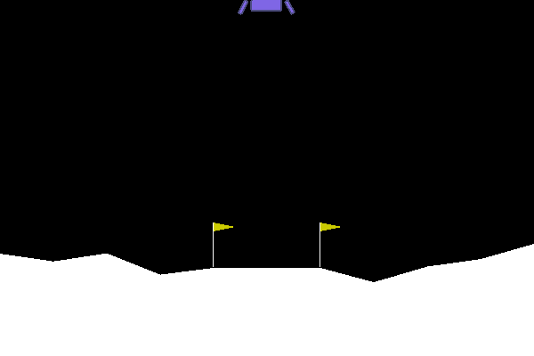

# Reinforcement Learning: Lunar Lander
## Project Overview
This project is a basic exercise in demonstrating the use of artificial intelligence with neural networks and reinforcement learning to have a Player (the AI) learn how to play a simple 2D game, Lunar Lander, with the goal of landing a space-ship between two flags on a random terrain. The space-ship is capable of making very basic movements (do nothing, fire left engine, fire down engine, and fire right engine) in order to navigate to the goal. 

The main technologies & libraries used in this project include:
- Python
- Visual Studio Code IDE
- [OpenAI's Gym API](https://github.com/openai/gym) - for the Lunar Lander game environment
- [Stable-Baselines3 Reinforcement Learning API](https://github.com/DLR-RM/stable-baselines3) - for streamlined reinforcement learning model implementation
- TensorBoard - for visual representations of model training

## Vocabulary
For ease of explantion, some basic vocabulary related to reinforcement learning will be reviewed: 

- ### Environment
What will the Player (the AI) be trying to play/solve? In this example, the AI will be playing in the Lunar Lander game provided within OpenAI's Gym API.

- ### Model 
What algorithm will the AI be using to learn with? Without a model/algorithm, the AI will only take random actions and is incapable of improving itself. In this example, we will demonstrate random play as well as using the [A2C](https://stable-baselines3.readthedocs.io/en/master/modules/a2c.html) and [PPO](https://stable-baselines3.readthedocs.io/en/master/modules/ppo.html) models. Details on *how* these models work is not important for this demonstration. 

- ### Agent
This is the virtual entity (the aformentioned AI/Player) that is interacting with the environment using the model.

- ### Observation ("State")
These are the important details of the environment that are fed to the model to make action predicitons. 

- ### Action 
What will the agent do after feeding an input observation (time-step)?
Actions can be "discreet" (clear classifications - go left or go right) or "continuous" (like regression, a range - go 0.02 right or 0.3261 up, etc). In our example, actions are Discreet.

- ### Step
A time-step in the environment. In general, each step in the environment will result in an Agent action in that environment followed by a new observation and a "reward" for the action taken. 

- ### Reward
The agent receives a reward, either positive or negative, for its action in each step based on how it interacted with the environment and the resulting subsequent observation.

## Basic Code (rl-random.py)
In this file we see the basic code required in order to load the Gym environment and have an Agent interact with the environment. As no model has been loaded, the Agent will only take random actions and cannot learn from its interactions in the environment. 

As we can see above (and as would be expected), the Agent performs very poorly just taking random actions. Without a model to learn with, any chance of the Agent completing the task is negligible. 

## Using A Model (rl-model.py)
In this file we can see some differences from the `rl-random.py` file, most notable the importation of the `PPO` model from `stable_baselines3` in the beginning. 
Many of the default settings for each model are adequate so we will not be making any material changes once the model is loaded in Line 10; this is the power of the stable_baselines3 package, which can also be seen in the ease of training the model with a simple `model.learn` on Line 11. As written, the model will train for 100k timesteps and then be rendered for visual evaluation. 

Let's see how it now performs:

Marginally better, but still pretty bad. This example demonstrates a significant issue with reinforcement learning: sample inefficieny, or more plainly that getting good results takes a substantial amount of training time for the AI depending on how complicated a particular task is; millions or even hundreds-of-millions (or more!) of timesteps are required which can take weeks or even months. Luckily for us, this task is quite a bit simpler and doesn't require nearly as much training time.

## Saving A Model (rl-model_save_PPO.py)
What good is a trained model if we cannot save it? In this file we will demonstrate how to do just that. Note the new import of the `os` library in the beginning, which will allow us to interact with the computer's filesystem and make a directory to save our model.

Also note the new parameter we're adding to the model on Line 21, `tensorboard_log=logdir`, which will allow us to have a visual representation of our model's training progress *while it is training* using the TensorBoard functionality (more on this later). The directory for `logdir` is created on Lines 13 and 14. 

For saving the model, we have also reconfigured some additional code; on Line 24 we have a new variable `TIMESTEPS` which will be used to note how many timesteps need to pass before the model is saved and the progress is logged to TensorBoard. The following code on Line 28 will simply loop over the 10k steps, in this case 100 times for a total of 1M steps, saving and logging the model every loop.

As the model trains, it will be logged to [TensorBoard](https://www.tensorflow.org/tensorboard/) which is a visualization tool to track certain metrics of model progress - in this case we will be interested in tracking "episode length mean" (the average of how long the lander stays aloft before finishing the task or crashing) and "episode reward mean" (the average reward each episode). Specifics on how rewards are calculated are not important for this projects, so the heuristic of "reward number goes up over time = good" will be adequate. 

Let's see how well this 1M timestep model performs:

Better, but still not great. It seems like the Agent is moving the ship in a little more controlled manner, but how does the TensorBoard look?

Here we can see how the model trained over time. Episode length (how long the lander was in the air), on average, shot up dramatically at the lander began to learn how to pilot the vehicle before beginning to peter off around 700k steps, then starting a gradual increase once again.
Episode reward (how well or poorly the lander performed in relation to actually landing in the goal area) also shot up dramatically as the model learned how to pilot. Note the volatility over time in the reward and how learning is not linear; the model will do what it can to prevent massive negative reward initially and then gradually take some more random actions as it attempts to "experiment" and explore what it can do, hence some of the choppiness between steps 400k and 1M. 

## Loading A Model (rl-model_load&test_PPO.py)
Observe the TensorBoard output once again and note that episode rewards seem to be maximized around step 900k. Thanks to our saving of the model evey 10k steps, we can actually load the model at this point in time and test it. The code to do so is a bit simplified from the previous file, but all we simply do is a `model = PPO.load()` as seen on Line 17 with the `model_path` parameter defined to our model directory's associated .zip file, in this case named `900000.zip`.

